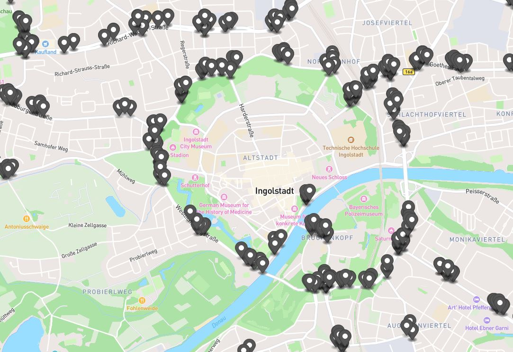

.. index:: ! Daten

###############################################################################
Daten
###############################################################################

.. index:: Zählschleifendaten

*******************************************************************************
Zählschleifendaten
*******************************************************************************

An den meisten Ampel-Kreuzungen im Stadtgebiet von Ingolstadt sind in den
Fahrspuren Verkehrsdetektoren in Form von Induktionsschleifen
(siehe :numref:`detector_locations`) eingelassen.
Diese erkennen ein darüberfahrendes Fahrzeug und meldet dieses an die
Ampelsteuerung.
Das Ampelprogramm nutzt diese Informationen zur bedarfsgerechten Regelung der
Kreuzung.

Daneben findet eine zentrale Ablage der Zählereignisse auf dem Verkehrsserver
der Stadt Ingolstadt statt.
Im Abstand von 15 Minuten wird ein Zählwert je Detektor für den Zeitraum auf dem
Server abgelegt.
Die Daten liegen jedoch auf zugangsbeschränkten Server nicht in einer Form vor,
die eine einfache Handhabe und Weiterverarbeitung ermöglichen.

Durch die Arbeit im Forschungsprojekt SAVeNoW werden die Daten regelmäßig vom
Verkehrsserver der Stadt abgerufen, bereinigt, formatiert und in den beschriebenen
:ref:`SensorThingsAPI-Server <services:frost-server>` hochgeladen.
Außerdem wird ein aggregierter Zählwert für die gesamte Kreuzung berechnet.
Neben der Vorverarbeitung der Daten werden diese mit Metainformationen und
Georeferenzen zu den Detektorpositionen angereichert.

Nach dem Hochladen sind sie über die standardisierte Schnittstelle abrufbar.
Aktuell besteht eine Verzögerung von 3-4 Minuten nach Ablauf der Zählperiode,
bis die Daten über die Schnittstelle erreichbar sind.

.. index:: Wetterdaten

*******************************************************************************
Wetterdaten
*******************************************************************************
