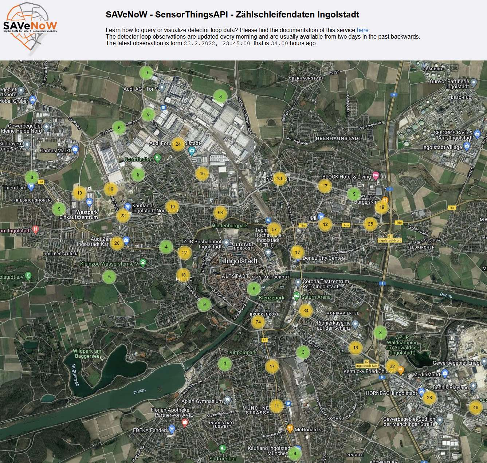
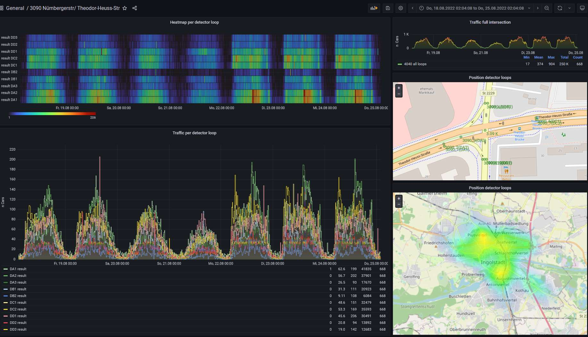

.. index:: ! Home, SAVeNoW, ! Content

###############################################################################
SAVeNoW - SensorThingsAPI
###############################################################################

  *Offene Standards und Dienste für die Verwaltung von Zählschleifendaten aus
  Ingolstadt in der Cloud*

.. image:: img/icon/savenow-logo.png
  :width: 120 px
  :align: center
  :target: https://www.savenow.de

.. image:: img/icon/favicon_tum.svg
  :width: 100 px
  :align: right
  :target: https://www.asg.ed.tum.de/gis/startseite

Die Stadt Ingolstadt stellt im Rahmen des Forschungsprojekts
`SAVeNoW <https://www.savenow.de/>`_ Daten der Kfz-Zählschleife aus dem
gesamten Stadtgebiet Stadtgebiet für den Zeitraum von August 2019
bis heute zur Verfügung. Die Daten liegen in 15-Minuten-Zeitschritten
für mehr als 700 Zählschleifen vor.

.. image:: img/icon/efs-logo.svg
  :width: 100 px
  :align: right
  :target: https://www.efs-auto.com/

Für die effiziente Verwaltung und interaktive Visualisierung der Daten
für die Projektpartner hat der
`Lehrstuhl für Geoinformatik (TUM) <https://www.asg.ed.tum.de/gis/startseite/>`_
in Zusammenarbeit mit `e:fs <https://www.efs-auto.com/>`_ einen
quelloffenen IoT-Anwendungsstack zusammengestellt.
Der Stack wird in einem :ref:`services:Kubernetes`-Cluster auf
Microsoft Azure `<https://azure.microsoft.com/de-de/>`_ Cloud Services
gehostet. Er besteht aus mehreren :ref:`IoT-Diensten <services:iot-dienste>`
zur Bereitstellung einer :ref:`standardisierte API <services:frost-server>` für den
Zugriff auf die Daten, einer :ref:`Übersichtskarte <services:zählschleifenkarte>`
für die Lokalisierung von Detektoren, sowie Werkzeugen zur
:ref:`Datenvisualisierung <services:grafana>`.

.. table:: Vorschau der Zählschleifenkarte und der Verkehrsdashboards.
  :align: center

  +--------+--------+
  | |fig1| | |fig2| |
  +--------+--------+

*******************************************************************************
Inhalt
*******************************************************************************

.. toctree::
  :maxdepth: 4

  services
  data
  contact

* :ref:`genindex`

.. Figure replacements --------------------------------------------------------

