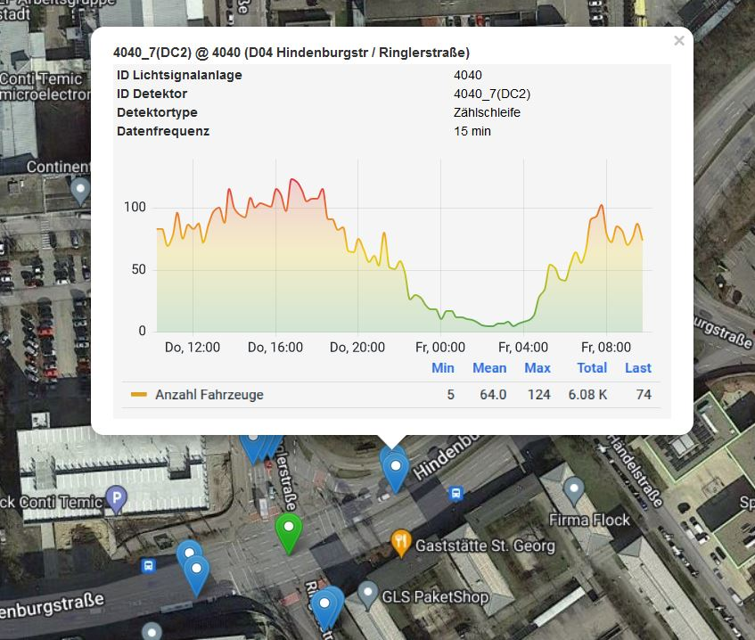

.. index:: !Startseite, ! SAVeNoW

###############################################################################
SAVeNoW - Verkehrsdaten von Ingolstadt
###############################################################################

  *Verwaltung von Zählschleifendaten mithilfe offener Standards und Dienste in 
  der Cloud*

.. image:: img/icon/savenow-logo.png
  :width: 140 px
  :align: center
  :target: https://www.savenow.de

Die Stadt Ingolstadt stellt im Rahmen des Forschungsprojekts
`SAVeNoW <https://www.savenow.de/>`_ Zählwerte von Kraftfahrzeugen aus dem
gesamten Stadtgebiet für den Zeitraum seit August 2019 zur Verfügung sowie
die aktuellen Livedaten.

Diese Zählwerte kommen von sogenannten Zählschleifen, die an allen 
wichtigen Kreuzungen mit Ampelanlage in der Straße je Fahrspur 
verbaut sind. 
Jede Zählschleife liefert alle 15 Minuten eine Zählung der Fahrzeuge, 
die die Schleife in der vergangenen Viertelstunde überfahren haben. Somit 
liegt das Verkehrsaufkommen für die wichtigsten Knotenpunkte in Ingolstadt 
spurgenau als 15-Minuten-Aggregate vor.

  Zählschleifen und Zeitreihe der Zählungen an der Kreuzung
  Hindenburg-/Ringlerstraße

Um die Daten für die Partner des Forschungsprojekts - und perspektivische die 
Bürger Ingolstadts - nutzbar zu machen, werden die Daten aufbereitet und über eine
*standardisierte Webschnittstelle*, die :ref:`standards:ogc sensorthingsapi`,
im Internet bereitgestellt.

.. image:: img/icon/favicon_tum.svg
  :width: 100 px
  :align: right
  :target: https://www.asg.ed.tum.de/gis/startseite

Dafür hat der
`Lehrstuhl für Geoinformatik, Technische Universität München (TUM) <https://www.asg.ed.tum.de/gis/startseite/>`_
in Zusammenarbeit mit `e:fs <https://www.efs-techhub.com/>`_ einen quelloffenen
*Internet of Things (IoT)* Anwendungsstack zusammengestellt.

.. image:: img/icon/efs-logo.svg
  :width: 100 px
  :align: right
  :target: https://www.efs-techhub.com/

Der Stack wird in einem :ref:`services:Kubernetes`-Cluster in der
`Microsoft Azure <https://azure.microsoft.com/de-de/>`_ Cloud
gehostet. Er besteht aus mehreren :ref:`IoT-Diensten <services:webdienste>`
zur Bereitstellung einer :ref:`standardisierten API <standards:ogc sensorthingsapi>`
für den Zugriff auf die Daten.
Auf Basis dieser API sind mehrere Datendienste, wie z.B. eine
:ref:`Übersichtskarte <services:Zählschleifenkarte>` zur Lokalisierung der
Zählschleifen (siehe :numref:`sta-map` ), sowie Werkzeugen zur
:ref:`Datenvisualisierung <services:grafana>` erstellt worden.

.. index:: ! Inhalt

*******************************************************************************
Inhalt
*******************************************************************************

.. toctree::
  :maxdepth: 4

  data
  standards
  services
  contact

* :ref:`genindex`
