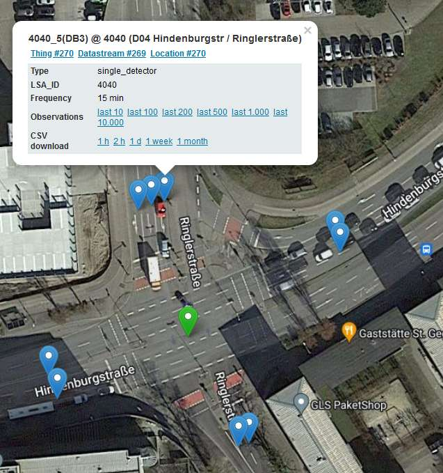
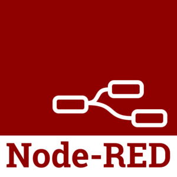

.. index:: Services

###############################################################################
Services
###############################################################################

.. index:: Detector loop map

*******************************************************************************
Detector loop map
*******************************************************************************

Die *Detector loop map* visualisiert alle Zählschleifen in Ingolstadt, die
mit der SensorThingsAPI verwaltet werden, auf einer `Leaflet <https://leafletjs.com/>`_
Webkarte. Eine Vorschau der Karte ist in :numref:`preview_map` und
:numref:`preview_map_close` zu sehen.

    |:map:| Hier geht's zur Karte: https://sta.savenow.de/map |:map:|

.. figure:: img/overview_map.jpg
  :width: 98 %
  :alt: SAVeNoW Detector loop map for Ingolstadt
  :align: center
  :name: preview_map
  :target: https://www.savenow.de/map/

  Preview of the SAVeNoW detector loop map.

  SAVeNoW Detector loop map closeup intersection Hindenburgstr./Ringlerstr.

.. index:: FROST-Server

*******************************************************************************
FROST-Server
*******************************************************************************

.. image:: img/icon/frost-server-icon.png
  :width: 120 px
  :align: right
  :alt: FROST-Server logo

Der FROST-Server ist eine Open Source Server-Implementierung der OGC SensorThings API.
Er ist in Java geschrieben und kann in Tomcat oder Wildfly laufen und ist als
Docker-Image verfügbar. Zu seinen vielen Funktionen gehört die Möglichkeit,
String- oder UUID-basierte Entity-IDs zu verwenden. FROST-Server ist ein Akronym
und steht für *Fraunhofer Open Source SensorThingsAPI Server*.
Der Name soll aber auch suggerieren, dass Ihre Daten *frisch und verfügbar*
gehalten werden.

.. rubric:: Funktionen

* Basiert auf SensorThings API, einem Standard des OGC (OGC ist eines der wichtigsten
  internationalen Standardisierungsgremien für Daten mit Raumbezug)
* Hohe Leistungsfähigkeit
* Geringer Ressourcenverbrauch
* Open Source: Volle Transparenz bei der Software

  * Offenheit gegenüber Erweiterungen von Anwendern
  * Offene Verfügbarkeit der Software garantiert langfristige Verfügbarkeit und
    ermöglicht strategische Entscheidungen

.. rubric:: Links

* Official website: https://www.iosb.fraunhofer.de/de/projekte-produkte/frostserver.html
* Github: https://github.com/FraunhoferIOSB/FROST-Server
* Documentation: https://fraunhoferiosb.github.io/FROST-Server/
* OGC SensorWebEnablement Overview: https://www.ogc.org/node/698
* OGC SensorThingsAPI Standard docs: https://www.ogc.org/standards/sensorthings
* OGC SensorThingsAPI API Documentation: https://developers.sensorup.com/docs/
* SensorThingsAPI Beispiele: https://fraunhoferiosb.github.io/FROST-Server/sensorthingsapi/1_Home.html

    |:rocket:| Hier geht's zum FROST-Server: https://sta.savenow.de/frost |:rocket:|

.. index:: Grafana

*******************************************************************************
Grafana
*******************************************************************************

.. image:: img/icon/grafana-icon.jpg
  :width: 70 px
  :align: right
  :alt: Grafana logo

Grafana ist eine plattformübergreifende Open-Source-Anwendung zur grafischen
Darstellung von Daten aus verschiedenen Datenquellen wie z. B. InfluxDB, MySQL,
PostgreSQL, Prometheus und Graphite.
Die erfassten Rohdaten lassen sich anschließend in verschiedenen Anzeigeformen ausgeben.
Diese können dann zu sogenannten Dashboards zusammengefügt werden.
Die Anzeigemöglichkeiten und Datenquellen können zudem mittels Plug-ins erweitert werden.
Auf diese Weise wird auch der FROST-Server direkt unterstützt und es können Dashboards
ohne zu programmieren in wenigen Klicks zusammengestellt werden.

.. rubric:: Links

* Official website: https://grafana.com/
* Github: https://github.com/grafana/grafana
* LinkSmart OGC SensorThingsAPI Plugin: https://github.com/linksmart/grafana-sensorthings-datasource
* Fraunhofer IOSB SensorThingsAPI Plugin:

    |:rocket:| Hier geht's zu Grafana: https://sta.savenow.de/grafana |:rocket:|

    |:rocket:| Hier geht's zu Grafana v7: https://sta.savenow.de/grafana7 |:rocket:|

.. figure:: img/dashboard.jpg
  :width: 98 %
  :alt: Preview of the Grafana dashboard for the intersection Nürnbergerstr./Theodor-Heuss-Str.
  :align: center
  :name: grafana
  :target: https://sta.savenow.de/grafana/

  Preview of the Grafana dashboard for the intersection Nürnbergerstr./Theodor-Heuss-Str.

*******************************************************************************
Node-RED
*******************************************************************************

Node-RED ist ein von IBM entwickeltes grafisches Entwicklungswerkzeug.
Die Software ermöglicht es, Anwendungsfälle im Bereich des Internets der Dinge
mit einem einfachen Baukastenprinzip umzusetzen. Die einzelnen Funktionsbausteine
werden durch Ziehen von Verbindungen verbunden. Eine große Auswahl an mitgelieferten
Bausteinen deckt die meisten der gängigsten Dienste und Technologien ab.
Im Jahr 2016 hat IBM Node-RED als Open-Source-Software der JS-Foundation übertragen.

    |:rocket:| Hier geht's zu Node-RED: https://sta.savenow.de/nodered |:rocket:|

.. index:: Kubernetes, k8s

*******************************************************************************
Kubernetes
*******************************************************************************

.. image:: img/icon/k8s.png
  :width: 120 px
  :align: right
  :alt: FROST-Server logo

Kubernetes ist ein von Google entwickeltes Open-Source-System zur Verwaltung von
Container Anwendungen. In diesem Umfeld wird die Verwaltung der technischen Container
Infrastruktur auch als Orchestrierung bezeichnet.

Die hier gelisteten Services werden in einem Kubernetes Cluster in der
Microsoft Azure Cloud gehostet. Der verwendete Helm Chart ist hier verfügbar:

    |:white_sun_behind_cloud:| Hier geht's zum Helm Chart:
    https://github.com/tum-gis/tum-gis-iot-stack-k8s
    |:white_sun_behind_cloud:|
