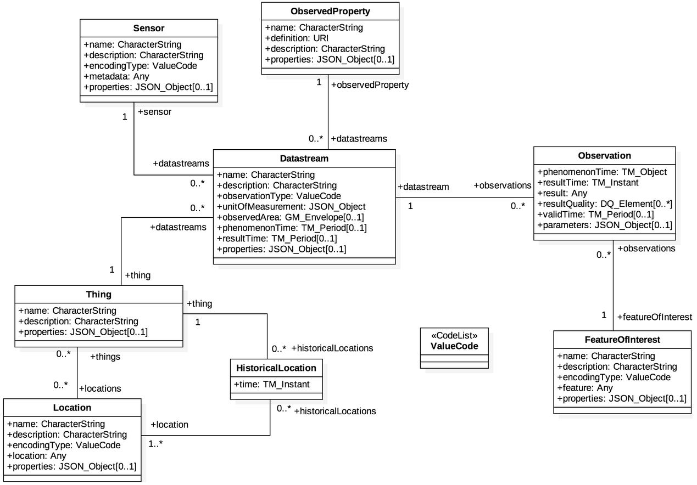

.. index:: ! Standards

###############################################################################
Standards
###############################################################################

.. index:: ! OGC SensorThingsAPI, ! SensorThingsAPI

*******************************************************************************
OGC SensorThingsAPI
*******************************************************************************

|:arrow_right:| `OGC SensorThingsAPI Homepage <https://ogcapi.ogc.org/sensorthings/>`_

Die `Open Geospatial Consortium (OGC) <https://www.ogc.org/>`_
SensorThingsAPI bietet eine offene, raumbezogene und einheitliche Möglichkeit,
Geräte, Daten und Anwendungen des Internets der Dinge (IoT) über das Web miteinander
zu verbinden.
Im wesentlichen bietet die OGC SensorThings API zwei Hauptfunktionalitäten,
wobei jede Funktion von einem Teil des Standards gehandhabt wird.
Die beiden Teile sind der Sensing-Teil und der Tasking-Teil.
Der Sensing-Teil bietet eine Standardmethode zum Verwalten und Abrufen von
Beobachtungen und Metadaten aus heterogenen IoT-Sensorsystemen.
Der Tasking-Teil ist als zukünftige Arbeitsaktivität geplant und wird in einem
separaten Dokument als Teil II der SensorThingsAPI definiert werden.

.. index:: SensorThingsAPI; Datenmodell

*******************************************************************************
Datenmodell
*******************************************************************************

  Datenmodell der SensorThingsAPI.

:numref:`sta-model` zeigt das Datenmodell der SensorThingsAPI. Sensorknoten werden
als ``Thing`` modelliert, denen eine ``Location`` zugewiesen werden kann.
Jedes ``Thing`` kann mit beliebig vielen ``Sensoren`` ausgestattet werden, die
wiederum beliebig viele z.B. phys. Eigenschaften (``ObservedProperties``) beobachten können.
Die tatsächlichen Beobachtungen (``Observations``) sind über einen ``Datastream`` erreichbar,
der ``Thing``, ``Sensor`` und ``ObservedProperty`` in Bezug setzt.

.. index:: SensorThingsAPI; Implementierungen

*******************************************************************************
Implementierungen der SensorThingsAPI
*******************************************************************************

Es existieren mehrere Implementierungen des SensorThingsAPI Standards. An dieser
Stelle wird nur die hier verwendete Implementierung aufgeführt.

|:arrow_right:| `Fraunhofer IOSB FROST-Server <https://www.iosb.fraunhofer.de/en/projects-and-products/frost-server.html>`_

.. index:: SensorThingsAPI; Referenzen

*******************************************************************************
Referenzen
*******************************************************************************

Die SensorThingsAPI ist international etabliert und an vielen Stellen im Einsatz:

* IoT-Infrastruktur der Stadt Hamburg

   * `zfv - Urban Data Platform Hamburg: Integration von Echtzeit IoT-Daten mittels SensorThings API <https://geodaesie.info/zfv/zfv-archiv/zfv-146-jahrgang/zfv-2021-1/urban-data-platform-hamburg-integration-von-echtzeit-iot-daten-mittels-sensorthings-api>`_

   * `FROST-Server API Endpunkt Iot-Hamburg <https://iot.hamburg.de>`_

* OGC SensorThingsAPI Standard Dokumente: https://www.ogc.org/standards/sensorthings
* OGC SensorThingsAPI API Dokumentation: https://developers.sensorup.com/docs/
* SensorThingsAPI Beispiele: https://fraunhoferiosb.github.io/FROST-Server/sensorthingsapi/1_Home.html
